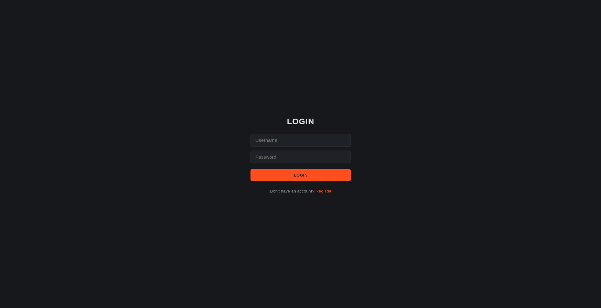
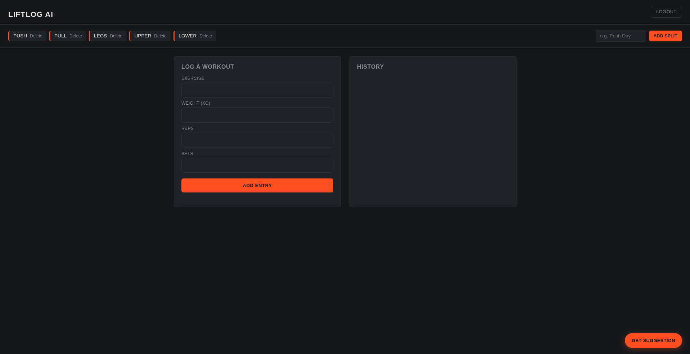
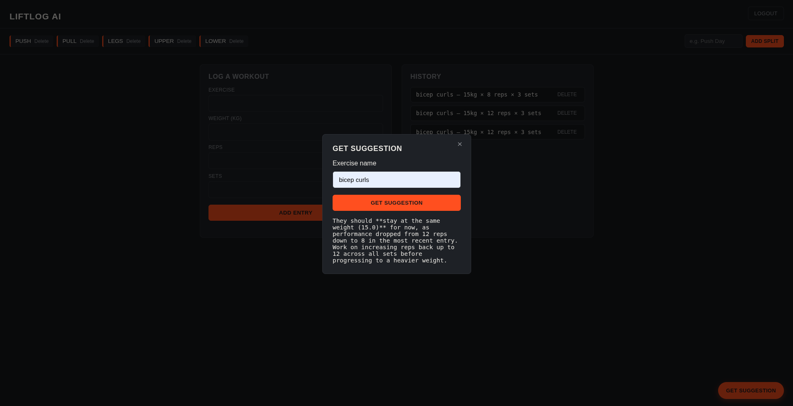

# LiftLog AI

A full-stack workout logging app with real AI-powered progression suggestions. Log your lifts, track splits as freeform notes, and get a suggestion — generated live by Google's Gemini API — on whether to bump up your weight, reps, or hold steady.

**Live demo:** [liftlog-eight-ruddy.vercel.app](https://liftlog-eight-ruddy.vercel.app/) · [API docs](https://liftlog-backend-ycan.onrender.com/docs)

> Note: the backend runs on Render's free tier, which spins down after ~15 minutes of inactivity. The first request after idling can take 30-50 seconds to wake up — that's expected, not a bug.

---

## Features

- **Auth** — register/login with hashed passwords and JWT-based sessions
- **Workout entries** — log exercise, weight, reps, and sets; view, and delete history
- **Splits** — name a split (e.g. "Push Day") and click into it to open a scrollable notepad for the full weekly plan
- **AI suggestions** — pulls your last 3 entries for an exercise and asks Gemini whether to increase weight, increase reps, or hold — not a hardcoded rule, an actual model call

## Tech stack

**Backend:** FastAPI, SQLModel, SQLite, JWT auth (python-jose + passlib), Google Gemini API
**Frontend:** Vanilla HTML/CSS/JS — no framework, no build step
**Deploy:** Render (backend), Vercel (frontend)

## Screenshots

**Login**


**Register**


**Main dashboard**


**AI suggestion**


## Running it locally

**Backend:**
```bash
cd backend
pip install -r requirements.txt
```
Create a `.env` file in `backend/` with:
```
SECRET_KEY=your_generated_secret
ALGORITHM=HS256
ACCESS_TOKEN_EXPIRE_MINUTES=30
GEMINI_API_KEY=your_gemini_key
```
Then run:
```bash
uvicorn main:app --reload
```
API docs available at `http://127.0.0.1:8000/docs`.

**Frontend:**
Open `frontend/index.html` in a browser, or serve the folder with any static file server. Update the API base URL in `app.js` if pointing at a local backend instead of the deployed one.

## A note on how this was built

This was my first project using FastAPI — built while learning the framework itself along the way, rather than after finishing a course first. Auth (JWT + hashing) was the hardest part; everything after it reused the same patterns (session dependency, protected routes) with less friction each time.
